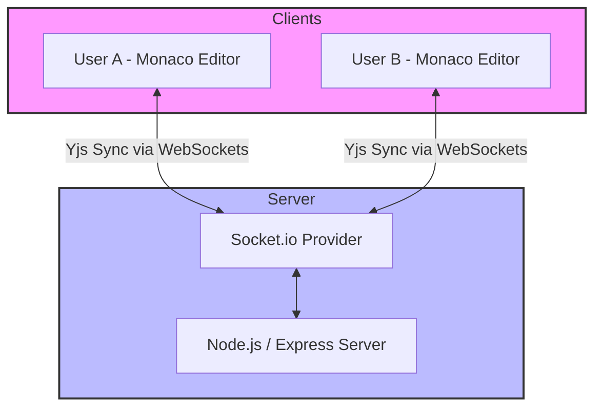

# 🚀 Collaborative Code Editor (Docker Project)

[](https://opensource.org/licenses/ISC)
[](https://nodejs.org/)
[](https://www.docker.com/)

A premium, real-time collaborative code editor built for seamless developer experiences. This project leverages the power of **Yjs** for CRDT-based synchronization and **Socket.io** for high-performance communication, ensuring conflict-free editing across multiple clients.

---

## ✨ Key Features

- 🔄 **Real-time Synchronization**: Powered by Yjs and `y-socket.io` for seamless, conflict-free collaboration.
- 💻 **Monaco Editor Integration**: Provides a VS Code-like experience with syntax highlighting and intelligent editing (via `@monaco-editor/react`).
- 🎨 **Modern UI/UX**: Responsive design built with **Tailwind CSS**, featuring a clean and intuitive interface.
- 🐳 **Dockerized Workflow**: Optimized multi-stage Docker builds for consistent development and ready-to-scale production deployments.
- 🚀 **High Performance**: Minimal latency using WebSockets for instant updates.

---

## 🛠️ Technical Architecture

The following diagram illustrates how the system manages synchronization between multiple clients using Yjs and WebSockets.



---

## 🏗️ Project Structure

```text
.
├── Dockerfile          # Optimized multi-stage Docker build
├── backend/            # Express.js Server
│   ├── server.js       # WebSocket logic & Static file serving
│   ├── public/         # Production build destination
│   └── package.json    # Backend dependencies (express, socket.io, y-socket.io)
└── frontend/           # Vite + React Frontend
    ├── src/            # Application logic, Monaco integration, & Yjs hooks
    ├── index.html      # Main entry point
    └── package.json    # Frontend dependencies (react, yjs, tailwindcss)
```

---

## 🚀 Getting Started

### Prerequisites

- **Node.js** (v20 or higher)
- **npm** or **yarn**
- **Docker** (optional, for containerized execution)

### Local Development

1. **Clone & Install Dependencies**
   ```bash
   git clone <your-repo-url>
   cd DockerProject
   ```

2. **Start the Backend**
   ```bash
   cd backend
   npm install
   npm run start  # Uses nodemon for development
   ```

3. **Start the Frontend**
   ```bash
   cd ../frontend
   npm install
   npm run dev    # Launches Vite dev server
   ```

### Running with Docker

Easily launch the entire stack using the provided Dockerfile.

1. **Build the Image**
   ```bash
   docker build -t collaborative-editor .
   ```

2. **Run the Container**
   ```bash
   docker run -p 3000:3000 collaborative-editor
   ```
   Access the app at: [http://localhost:3000](http://localhost:3000)

---

## 🚢 Deployment

This project is built for scale. The `Dockerfile` uses a **multi-stage build** strategy:
1. **Frontend Build**: Compiles React assets using Vite.
2. **Production Image**: A lightweight Node.js environment serving the compiled frontend as static assets from the `backend/public` directory.

> [!NOTE]
> This project has been verified for deployment on AWS.
> Sample ALB Endpoint: `docker-aws-ALB-1195696341.ap-northeast-1.elb.amazonaws.com`

---

## 🤝 Contributing

We welcome contributions! To contribute:
1. **Fork** the repository.
2. Create a **Feature Branch** (`git checkout -b feature/CoolFeature`).
3. **Commit** your changes (`git commit -m 'Add some CoolFeature'`).
4. **Push** to the branch (`git push origin feature/CoolFeature`).
5. Open a **Pull Request**.

---

## 📄 License

Distributed under the **ISC License**. See `LICENSE` for more information.

---

## 👋 Author

**BhaveshJain28** - [GitHub](https://github.com/BhaveshJain28)

---
*Built with ❤️ for the developer community.*
